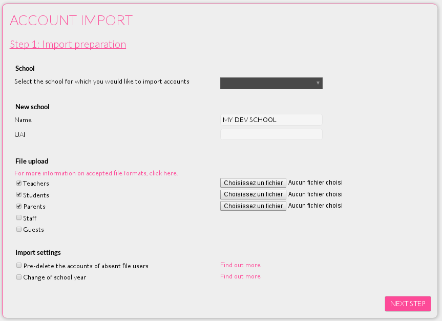
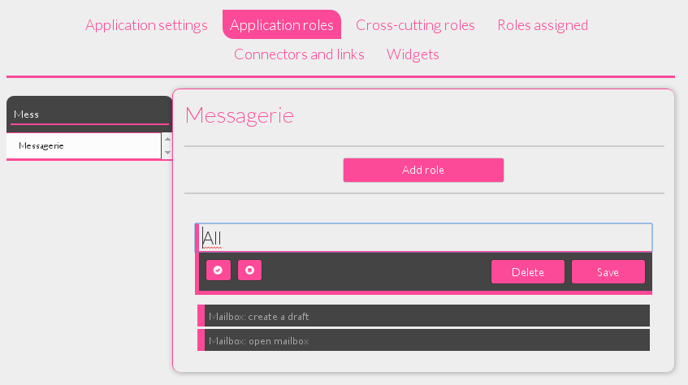
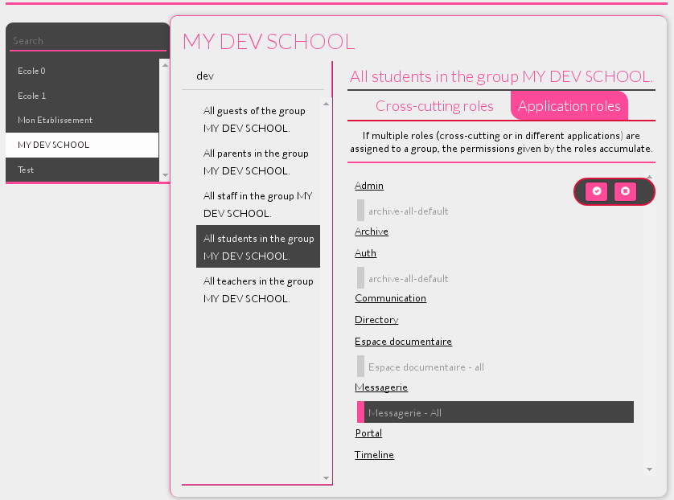
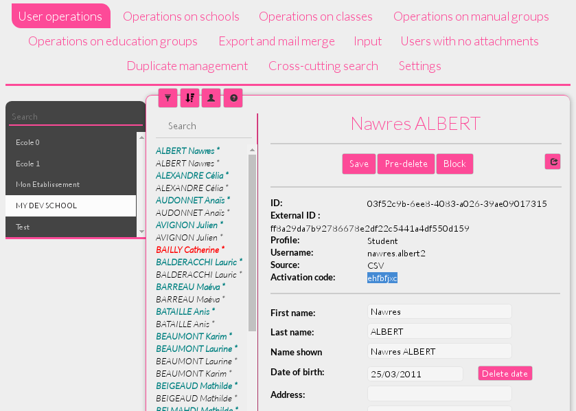

# Import a structure data set

In ODE platform, a structure is typically a school or a grouping of school.
The user’s data loading process is designed around this notion of structure,
because schools are the "master data" of user’s identity.

-   Connect with the default super user : `tom.mate` / `password`

-   Go to URL : <http://localhost:8090/directory/wizard> (it’s the CSV’s import wizard)

-   Use the test data set located in `path-tospringboard/sample-be1d/EcoleprimaireEmileZola` folder

Fill the form as described in the screenshot below

-   Choose a name for your new school

-   Upload files for each user profile :

    -   `CSVExtraction-eleves.csv` for **Students**

    -   `CSVExtraction-enseignants.csv` for **Teachers**

    -   `CSVExtraction-responsables.csv` for **Parents**

-   Click **Start import** on Step 2 screen

-   Click **Finish** on Step 3 screen (The following message is displayed : "Your import has been successfully completed")

# Configure application roles

In ODE platform, each application provides its set of precise permissions.
You have to group the permissions into high level roles before granting user access.

-   Go to <http://localhost:8090/appregistry/admin-console>

-   Chose "**Application roles**" menu

-   Enter "*Message*" in the left search field and select the application called "*Messagerie*"

-   Press button **Add Role**

-   Name your role "*All*"

-   Select all permissions ("*Mailbox: create a draft*" and "*Mailbox: open mailbox*" )

-   Press button "Save"

# Grant roles to groups

-   Choose "**Roles assigned**" menu

-   Select the school called \* "*MY DEV SCHOOL*"

-   Enter "*MY DEV*" in the second search field

-   Select a group (eg. "*All students in group*")

-   Choose "**Application roles**" menu

-   Enter "*Message*" in left search field and select the application called \* "Messagerie\_"

> **Tip**
>
> Grant access to all school groups to ease further testing operations.

# Activate user

As user accounts are batch imported, each user receives an activation code.
When he first logs in, the user has to choose a secret password.

-   Go to <http://localhost:8090/directory/admin-console#/>

-   Choose "**User operations**" menu

-   Select the school called \* "*MY DEV SCHOOL*"

-   Select a user

-   Copy his Activation Code and remember his login

-   Log out from Admin console

-   Go to <http://localhost:8090>, to activate your user

> **Note**
>
> User color depends of his profile.
> Red for Teacher ;
> Green for Staff ;
> Yellow for Parent ;
> Blue for Guest ;
> Black for Student
